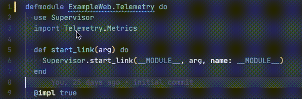

# VS Code Credo (Elixir Linter)

[](https://github.com/pantajoe/vscode-elixir-credo/actions)
[](https://marketplace.visualstudio.com/items?itemName=pantajoe.vscode-elixir-credo)
[](https://open-vsx.org/extension/pantajoe/vscode-elixir-credo)
[](http://opensource.org/licenses/MIT)

This VS Code extension provides display of the output of the static code analysis tool [Credo](https://github.com/rrrene/credo)
for the programming language [Elixir](https://elixir-lang.org).

## Features

* Lint all opened documents and display diagnostics
* Re-lint a document after saving it
* Either lint all elixir files or only those specified by the linting configuration
* Specify a custom configuration file for Credo
* Specify a custom configuration for Credo
* Specify a custom execute path for the `mix` binary
* Specify wheterh you want to use Credo's [diff mode](https://hexdocs.pm/credo/diff_command.html#from-git-merge-base)



## Requirements

Add the Elixir linter [Credo](https://github.com/rrrene/credo) to your dependencies in your project's `mix.exs` file
and install it by running `mix deps.get`.

## Extension Settings

This extension contributes the following settings:

* `elixir.credo.configurationFile`: location of the configuration file Credo should use. Can be an absolute path, a relative path or simply a file.
* `elixir.credo.credoConfiguration`: name of the configuration Credo should use. Uses the default configuration per default (`default`).
* `elixir.credo.strictMode`: whether to utilize Credo's strict mode when linting.
* `elixir.credo.executePath`: execute path of the `mix` executable
* `elixir.credo.checksWithTag`: specify tags of those checks which should be used in VS Code (all other checks will be ignored)
* `elixir.credo.checksWithoutTag`: specify tags of checks which should be ignored in VS Code
* `elixir.credo.ignoreWarningMessages`: ignore warning messages (concerning finding the configuration file)
* `elixir.credo.lintEverything`: lint any elixir file (even if excluded in the Credo configuration file)
* `elixir.credo.enableDebug`: toggle extensive logging to extension's output channel
* `elixir.credo.diffMode.enabled`: enable Credo's diff mode
* `elixir.credo.diffMode.mergeBase`: specify the merge base for the diff mode

### Troubleshooting

> "The `mix` binary is not executable."

If this warning pops up, the vscode extension's credo child process does not have the path of the mix binary in its `PATH`.
Thus, try to set the correct path of the `mix` binary in the configuration's settings under `"elixir.credo.executePath"` (Elixir > Credo > **Execute Path**).

> "Command `/bin/mix credo` returns empty output!"

This message indicates that the extension cannot get an output from Credo. The problem could be caused by:

* Credo or one of its dependencies is missing.
* Credo has a problem reading your project's configuration.

First make sure Credo is installed and that Credo has the dependencies installed locally it requires to function. Install them to local archive by running the following commands.

```bash
mix archive.install hex credo
mix archive.install hex bunt
mix archive.install hex jason
```

Then try to generate `.credo.exs` for your project by running `mix credo gen.config` in your project's root folder.
If this step fails the output could tell you the exact reason for the failure. The problem can be something as simple as a minor syntax error in your `config/dev.exs`.

> "`.credo.exs` does not exist. Ignoring..."

You will probably want the extension to look for your custom Credo configuration files. If you are working on an umbrella Mix application, having `.credo.exs` only in the root of your app is not enough; the file needs to be present in each app covered by the umbrella.

If you want your root configuration to apply equally to all child apps, then you can create a symbolic link to it within each app by running the following from the root directory of your umbrella:

```sh
$ for dir in apps/*; do ln -s ../../.credo.exs "$dir/.credo.exs"; done
```

**Hint:**

Sometimes, any problem you might have is caused by VS Code not having the same `PATH` environment variable as your shell.
To make sure VS Code has the same environment as your shell,
simply close all VS Code processes and open VS Code from you command line by executing the binary `code` in your shell of choice.

## Changelog

See [Changelog](/CHANGELOG.md)

## Contribution

When contributing, please refer to [the Contribution Guide](/CONTRIBUTING.md)

## License

This software is released under the [MIT License](/LICENSE).

&copy; 2020-2022 Joe Pantazidis
